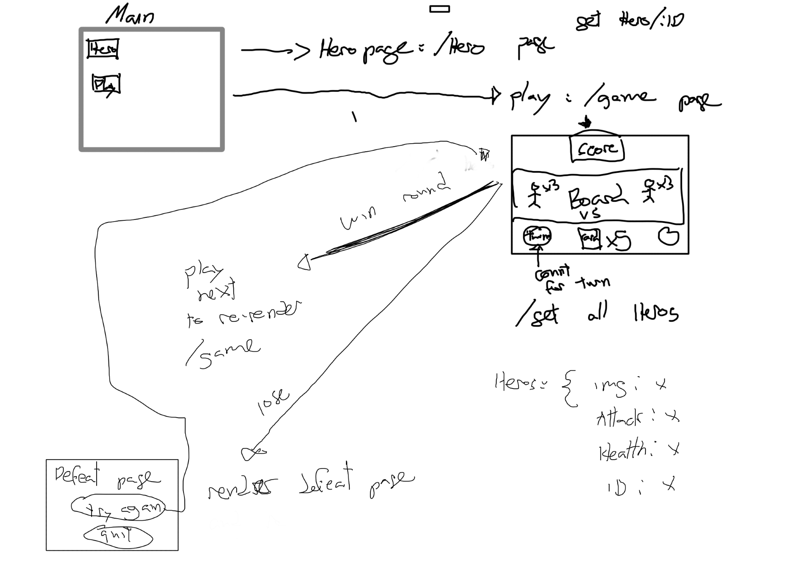
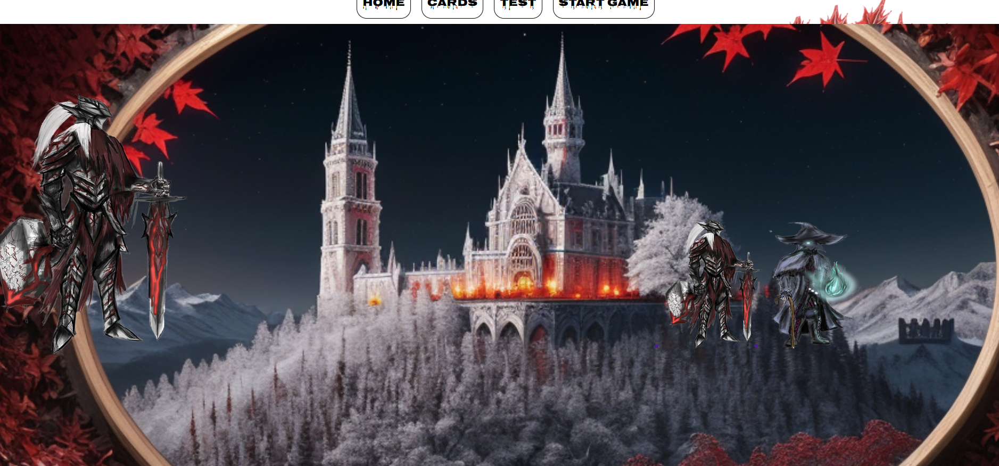
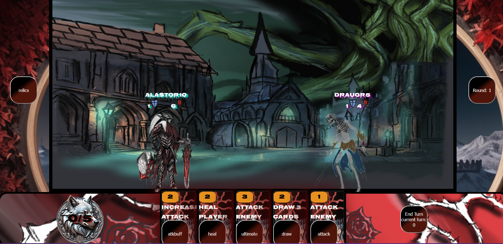
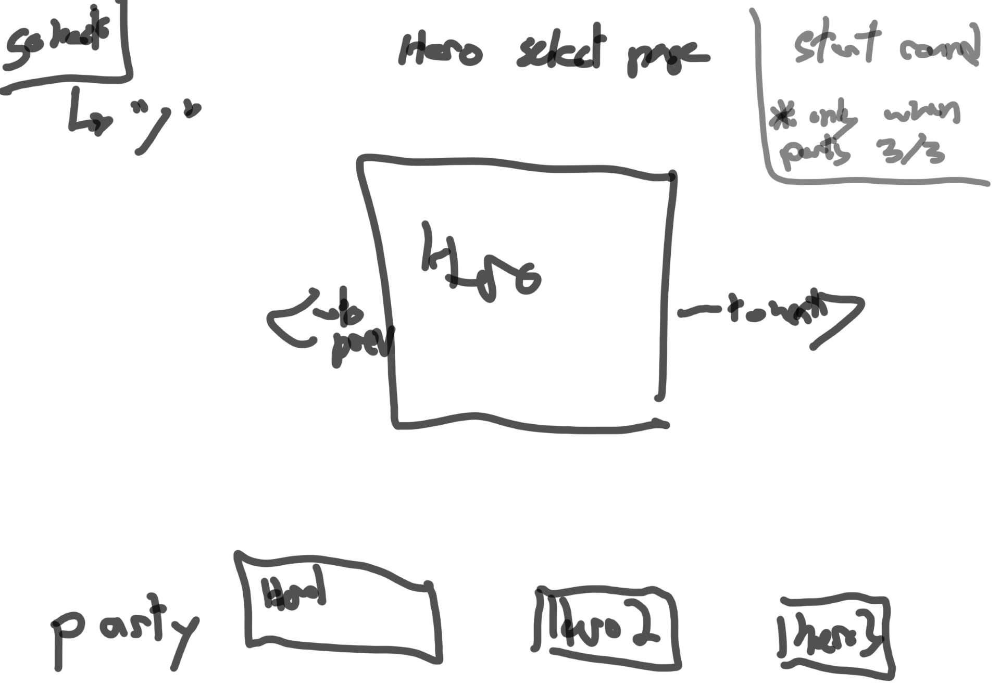

# Project Title

## Overview

My app would be a card game called gambit, User select three heroes and fight undead monsters. game will split into enemy phase and player phase where players will draw 5 cards at the start of their turn to use either defensively or offensively.

### Problem

I grew up playing card games and wanted to make one from my own art. Something easy to pick up yet every time you play changes would occur in either hero composition and enemy composition to keep encounters fresh.

### User Profile

my App would mostly be used for gamers either playing through steam or in real time with physical cards. fans of pokemon and yugioh would have an attraction to the concept.

### Features

-main menu functionality to start a run
-react app to use state for enemy/player turns
-api to call and render cards
-css animation for user interaction and card draws.
-logic for attacking, defending.
-potential for unique card effects(to be determined based on complexity)

## Implementation

### Tech Stack

-react
-express
-react-spring
-axios
-react-router-dom
-sass

### APIs

The only external source of data would be my own collection of drawings. the data structure will have objects with {id: x, img:x, atk:x, health:x}. end points to call will be /heros for all and /heroes/:id for individuals

### Sitemap

-main menu page(start button and hero library)
-start run page which will let you select heroes before every run
-transition to board game page
-on board game page i will use states to render active turn.
-board page will also need to contain all the logic available for combat. and a next round button.
-a defeat page and victory page

### Mockups

Provide visuals of your app's screens. You can use tools like Figma or pictures of hand-drawn sketches.

### Data

data would be used to render enemies and heroes, the api call objects would provide the card design and card attributes.

### Endpoints

since this api will only render cards only a get request would be necessary, perhaps adding a post to make a scoreboard.

### Auth

Not for now.

## Roadmap

1-build a basic page for two 3 vs 3 cards and focus on building game logic(backend)
2-once basic game logic is set up react front end will be built for board page
3-styling and animation for card hover, attacking/defending and active player
4-drawing card animation with randomizing which cards are drawn
5-build api calls to dynamically generate the 3vs3 cards and card drawn into hand
6-once combat is functional, begin process of building the other pages with correcting routing.

## Nice-to-haves

-i'd like to add more complex card effects
-more heroes and drawings, these are hand made so they will be added as more are produced.
-a more complex game design, adding potential for a rogue lite mechanic where every run (win or lose) players would be rewarded with new cards to make next runs easier. this would add a greater sense of progression.
-wayyyyyy down the line would be animating all monsters and heroes.
